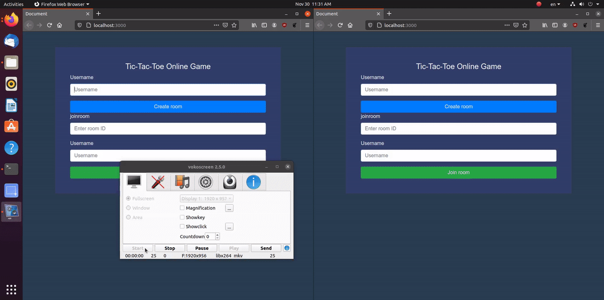

# TicTacToe-online
TicTacToe online game
## Getting Started

### Prerequisites
* you must install nodejs in your system
* Terminal or gitbash for windows
* mongodb server
### Installation

* first you must clone the project using git

```bash
git clone https://github.com/moyad123/tictactoe-online.git
```
* Then cd to blog_project

```bash
cd tictactoe-online
```
install dependencies using npm install

```bash
npm install
```

Start mongodb server

run the program

```bash
npm run start
```
## Demo


## License
[MIT](https://choosealicense.com/licenses/mit/)
